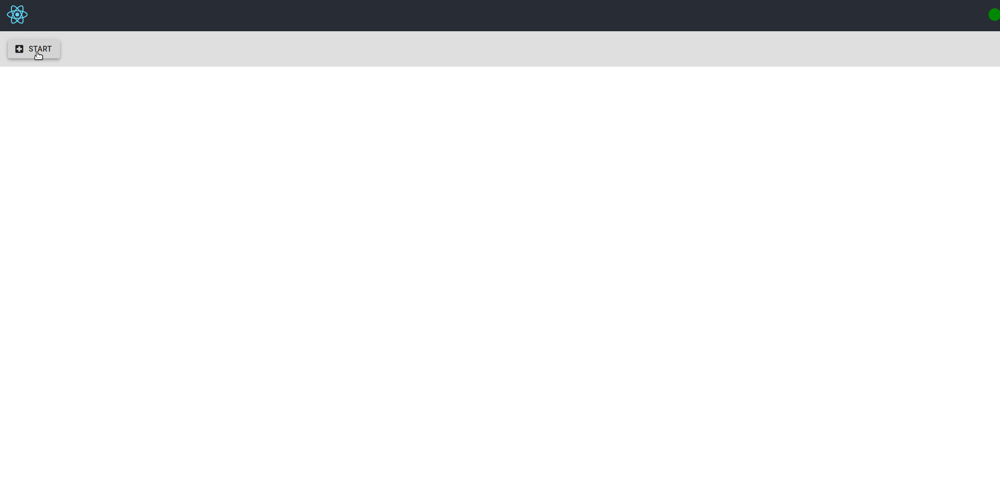

# gRPC Kotlin Quick Starter
As simple grpc implementation using kotlin.

##### proto
Defines the service as proto files.

---
##### stub 
Generates the Kotlin/java classes for the proto files

---
##### server
Implements the services and server app.

---
##### client
Defines a client library
